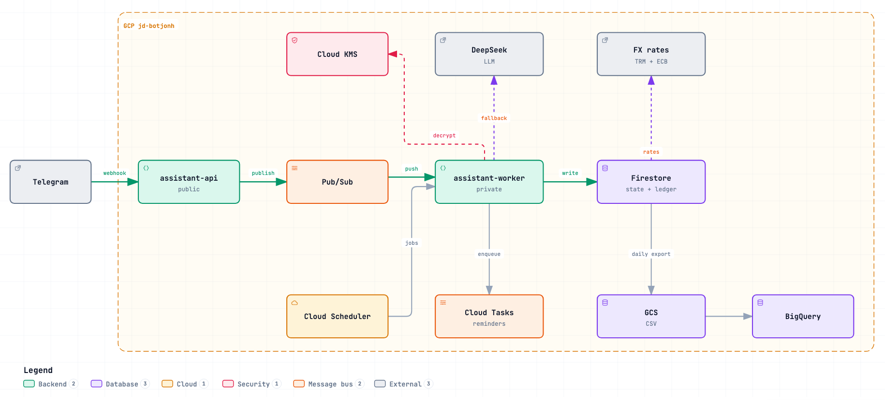
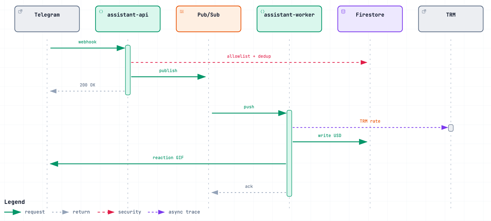

# telegram-personal-assistant

A single-user Telegram bot that is a finance advisor and a calendar: it logs
expenses and income to a Firestore ledger, recommends budgets to save, keeps its
own agenda of appointments (medical, personal) that you subscribe to from
Google, Apple or Outlook as a private ICS feed, and sends exact-time reminders
on Telegram. It runs for one owner plus a small allowlist of beta
testers, on GCP for about $1–2/month (LLM tokens only).

- **Channel:** Telegram Bot API (webhook → Cloud Run).
- **LLM:** DeepSeek `deepseek-flash` over its HTTP API (tool calling,
  automatic prefix cache). Minimal context is sent: never the full ledger.
- **State:** Firestore (users, idempotency, preferences, budgets, the
  append-only finance ledger and the agenda).
- **Reminders:** Cloud Tasks, one task per reminder, POSTed to the worker at
  the exact time.
- **Reporting:** the ledger is exported daily as CSV to GCS; a BigQuery external
  table over those files feeds a Looker Studio dashboard, at about $0.
- **Observability:** the shared MLflow server in `jd-portfolio-shared`
  (prompt hash, tokens, latency, cost per turn; message text hashed).

## Architecture



One expense message (`café 2000cop`), handled without the LLM:



Interactive versions (theme, zoom, guided views): open
[`docs/architecture/architecture.html`](docs/architecture/architecture.html) and
[`docs/architecture/expense-turn.html`](docs/architecture/expense-turn.html)
locally. They are generated with [archify](https://github.com/tt-a1i/archify)
from the `.json` specs next to them; edit the spec and re-render instead of
editing the HTML.

Two Cloud Run services on purpose: Cloud Run does not guarantee CPU between
requests, so `assistant-api` acknowledges the webhook in under 300 ms and only
publishes to Pub/Sub; `assistant-worker` consumes, calls the LLM, writes and
replies. Idempotency by `update_id` in a Firestore transaction.

See [PLAN.md](PLAN.md) (Spanish) for the full plan, costs and roadmap.

## Stack

FastAPI, httpx (DeepSeek, Telegram), `google-cloud-*` (Firestore, Pub/Sub,
Storage, Tasks), `mlflow-skinny`, uv + ruff + mypy + pytest, Terraform, GitHub
Actions. The ICS feed is written by hand (no calendar library).

## Run locally

Requires [uv](https://docs.astral.sh/uv/) and Python 3.12.

```bash
uv sync
uv run pre-commit install
uv run pytest
uv run mypy src
uv run ruff check . && uv run ruff format --check .
```

Local runs use a `.env` (git-ignored) with the same variables as the deploy;
see [Configuration](#configuration).

## Reproduce on GCP

1. Create a GCP project (globally unique id) and link it to the billing
   account, then apply the base infrastructure:

   ```bash
   gcloud auth application-default login
   cd infra
   cp terraform.tfvars.example terraform.tfvars   # set project_id, billing_account, github_repo
   terraform init
   terraform apply
   terraform output github_variables
   ```

2. Create the bot with @BotFather and store the secrets without echoing them:

   ```bash
   read -rs TOKEN && printf '%s' "$TOKEN" | gcloud secrets versions add assistant-bot-token --data-file=- --project "$PROJECT_ID"
   openssl rand -hex 32 | tr -d '\n' | gcloud secrets versions add assistant-webhook-secret --data-file=-
   openssl rand -hex 32 | tr -d '\n' | gcloud secrets versions add assistant-webhook-path --data-file=-
   read -rs KEY   && printf '%s' "$KEY"  | gcloud secrets versions add assistant-deepseek-key --data-file=-
   ```

3. Configure GitHub: set the values from `terraform output github_variables`
   plus the environment-specific variables, then create the `staging`
   (branch `dev`) and `production` (branch `main`) environments. After the
   first deploy, set per environment `WORKER_URL` (the worker's Cloud Run URL;
   reminders are skipped while it is empty) and `API_URL` (the api's URL, for
   the ICS link), then deploy again.

4. In @BotFather, `/setcommands` for the bot and paste:

   ```
   calendario - próximos 7 días
   ultimos - últimos 5 movimientos
   editar - editar un movimiento: /editar 1 3usd
   anular - anular un movimiento: /anular 1
   gif - guardar GIFs de reacción
   conectar - conectar tu calendario (enlace iCal secreto)
   vincular - vincular tu Google Calendar (instantáneo)
   start - activar
   ```

5. Add yourself as the owner (your chat id from @userinfobot), with ADC
   pointed at the project. Owners invite beta users from the chat; a beta joins
   with `/start <code>`:

   ```bash
   GCP_PROJECT_ID="$PROJECT_ID" uv run python -m assistant.admin add-owner <chat_id> <nombre>
   for c in processed invites rate spend pending; do
     gcloud firestore fields ttls update expire_at --collection-group="$c" --enable-ttl --async
   done
   ```

   The loop enables TTL cleanup of the dedup markers, invites, counters and
   pending confirmations.

6. Register the webhook and start using the bot:

   ```bash
   curl "https://api.telegram.org/bot$TOKEN/setWebhook?url=$API_URL/tg/$PATH&secret_token=$SECRET"
   ```

Every merge into `dev` deploys `assistant-api-staging` / `assistant-worker-staging`;
merging `dev` into `main` deploys production.

## Quick entry and editing (no LLM)

A message with exactly one amount is registered by code, without the LLM (zero
tokens): `gasto 2 usd cafe`, `2 usd cafe`, `cafe 2000cop gasto`, `2000 cop cafe`,
`cafe 5`, `$3.50 uber`, `1.234,56 cop arriendo`, `1000usd ingreso`,
`ingreso 1000 salario`, `+500 salario`. The word `ingreso` or a leading `+`
makes it income; `gasto`, a leading `-` or any other words make it an expense.
A bare amount (`5`, `5 usd`) is not guessed: the bot asks with Gasto / Ingreso
buttons and registers on the tap. The currency is an ISO code next to the amount
(USD, COP, EUR, MXN, PEN, CLP, ARS, BRL, GBP, CAD, PAB), `$` or `€`; none means
USD. The ledger converts to USD. `2,000`/`2.000` are thousands, `2,5` is 2.5.
The rest of the words are the note; a few keywords pick the category (`cafe` →
restaurantes, `uber` → transporte, `netflix` → suscripciones…), else `otros`.
Two amounts, questions, dates or times (`mañana a las 4`, `16:00`, `lunes`) go
to the LLM.

- `/ultimos`: the last 5 movements, numbered (1 = the most recent).
- `/editar <n> <monto>[moneda]`: `/editar 1 3usd`, `/editar 2 2000 cop`.
- `/anular <n>`: asks with Confirmar/Cancelar buttons, then voids it.
- In free text the LLM does the same: "el último era 3 dólares, no 5".

**Reaction GIFs.** Send a GIF with the caption `gasto` or `ingreso` (or reply
to a GIF with `/gif gasto`) to save it (`gifs/{chat_id}`, 20 per type). After
each quick registration the bot answers with a random one of that type and no
text; the text line (`−0.49 USD · café (2,000 COP)`) is only the fallback when
no GIF is stored or sending it fails. `/gif` shows usage and counts.

**Scheduled messages** (America/Panama): 07:30 agenda of the day and
yesterday's spend; 22:00 every movement of the day and the day's spend;
Sunday 20:00 the week's spend, top categories and, against the month's income,
the 20% to save and what is left per week.

## Finance ledger and reporting

Firestore is the source of truth: `ledger/{chat_id}/movimientos/{doc_id}`, one
append-only document per movement with `fecha` (ISO date), `monto` (string,
2 decimals), `moneda`, `categoria` (gasto) or `fuente` (ingreso), `tipo_mov`
(`gasto`|`ingreso`), `nota`, `batch_id`, `update_id`, `tipo`
(`registro`|`reverso`) and `creado`. Doc ids make writes idempotent: gasto
`{update_id}-{i}`, ingreso `{update_id}-i0`, undo `{batch_id}-r{i}` (negative
`reverso` copies; nothing is edited or deleted).

Every morning the `digest` job exports the previous day's writes (America/Panama)
to `gs://$BACKUP_BUCKET/ledger/mes=YYYY-MM/YYYY-MM-DD.csv` with the header
`fecha,chat_id,tipo_mov,categoria,monto,moneda,nota,batch_id,tipo`. Files are
create-only and kept forever; the weekly JSON backup lives under `backup/` with a
90-day lifecycle. Sum `monto` to net out undos (`reverso` rows are negative).

Terraform creates the BigQuery external table `botjonh.ledger` over those files
(`terraform output bigquery_ledger_table`). To build the dashboard:

1. Open [lookerstudio.google.com](https://lookerstudio.google.com) → **Create** →
   **Data source** → **BigQuery** → project `jd-botjonh` → dataset `botjonh` →
   table `ledger` → **Connect**.
2. Add a calculated field `bucket` for the 50/30/20 rule:

   ```
   CASE
     WHEN categoria IN ("vivienda","servicios","supermercado","transporte","salud","deudas") THEN "necesidades"
     WHEN categoria IN ("ahorro","inversion") THEN "ahorro"
     ELSE "ocio"
   END
   ```

3. Suggested charts (filter `tipo_mov = gasto` unless noted): monthly spend
   trend (time series, `fecha` by month, SUM `monto`); spend by `categoria`
   (bar); 50/30/20 split by `bucket` (pie) next to income (`tipo_mov = ingreso`).

## Agenda

The bot keeps its own agenda in Firestore:
`agenda/{chat_id}/eventos/{evento_id}` with `titulo`, `inicio`/`fin` (ISO with
the user's offset, plus `inicio_utc`/`fin_utc` for range queries), `ubicacion`,
`recordatorio_min`, `tipo` (`evento`|`recordatorio`), `estado`
(`activo`|`cancelado`) and `creado`. The id is the Telegram `update_id`, so a
retry never duplicates; cancelling only flips `estado`.

- **Conflicts:** before scheduling, the code checks the agenda and the busy
  blocks of a connected calendar (`/conectar <url>`); on a clash it asks
  "Choca con … ¿Agendo igual?" with buttons. "¿Qué tengo libre el jueves?"
  lists free slots between 08:00 and 20:00.
- **`/calendario`** lists the next 7 days, one line per day, without calling
  the LLM: `Jue 2 · 09:00 Dentista · 16:00 Llamada banco`.
- **Reminders** are Cloud Tasks at the exact time (`inicio - recordatorio_min`,
  or `cuando` for a recordatorio), so Telegram pings you on the minute. Cloud
  Tasks schedules at most 30 days ahead; later reminders are enqueued by the
  morning digest once they are within 30 days. Cancelling deletes the task.

### Google Calendar (instant)

Share your Google Calendar with
`assistant-worker@jd-botjonh.iam.gserviceaccount.com` (Settings → your
calendar → Share with specific people → **Make changes to events**), then send
`/vincular <calendar_id>` (for a personal account the primary calendar id is
your Gmail address; `/vincular off` unlinks). From then on every create and
cancel is mirrored there within seconds, and conflicts read that calendar
directly (your own mirrored events never clash with themselves). Firestore
stays the source of truth; the mirror is best effort. Requires the Calendar API
(`calendar-json.googleapis.com`) enabled in the project.

### Subscribe from your calendar app

`/calendario enlace` replies with your private URL
(`$API_URL/ics/<token>.ics`); anyone with it can read your agenda, so
`/calendario nuevo` replaces it and revokes the old one.

- **Google Calendar (web):** Other calendars → **+** → **From URL** → paste the
  link → **Add calendar**.
- **Apple Calendar:** iPhone: Settings → Calendar → Accounts → Add Account →
  Other → Add Subscribed Calendar. Mac: File → New Calendar Subscription.
- **Outlook:** Add calendar → Subscribe from web → paste the link → Import.

Subscriptions are read-only and refreshed by the app, not pushed: Google
refreshes every ~8–24 h (Apple and Outlook let you pick an interval), so a new
appointment may take hours to show there. The Telegram reminder does not
depend on that refresh and arrives at the exact time.

## Configuration

All secrets come from Secret Manager; settings from environment variables.

| Variable | Description |
|---|---|
| `GCP_PROJECT_ID` | GCP project |
| `TELEGRAM_BOT_TOKEN` | Secret `assistant-bot-token` |
| `WEBHOOK_SECRET_TOKEN` | Secret `assistant-webhook-secret` (X-Telegram-Bot-Api-Secret-Token) |
| `WEBHOOK_PATH` | Secret `assistant-webhook-path` (webhook route) |
| `DEEPSEEK_API_KEY` | Secret `assistant-deepseek-key` |
| `WORKER_URL` | Worker Cloud Run URL, target of the reminder tasks (per environment; empty = no reminders) |
| `WORKER_SA` | Worker service account, signs the reminder tasks' OIDC token (`GCP_WORKER_SA`) |
| `TASKS_QUEUE` | Cloud Tasks queue, default `assistant-reminders` |
| `TASKS_LOCATION` | Queue region, default `us-central1` |
| `API_URL` | Public api URL, for the ICS subscription link (per environment) |
| `MLFLOW_TRACKING_URI` | Shared MLflow server |
| `LLM_MODEL` | Default `deepseek-flash` |
| `BACKUP_BUCKET` | Weekly JSON backup and daily ledger CSV (from `terraform output`) |
| `MAX_MSGS_PER_MINUTE` | Per-chat rate limit (default 10) |
| `MAX_LLM_USD_PER_DAY` | Daily LLM spend cap per chat, default 0.10 (fails closed) |

## Contributing

Changes go on a `feat/`, `fix/` or `chore/` branch cut from `dev` and merge
into `dev` through a pull request; merging `dev` into `main` releases. See
[CONTRIBUTING.md](CONTRIBUTING.md).
